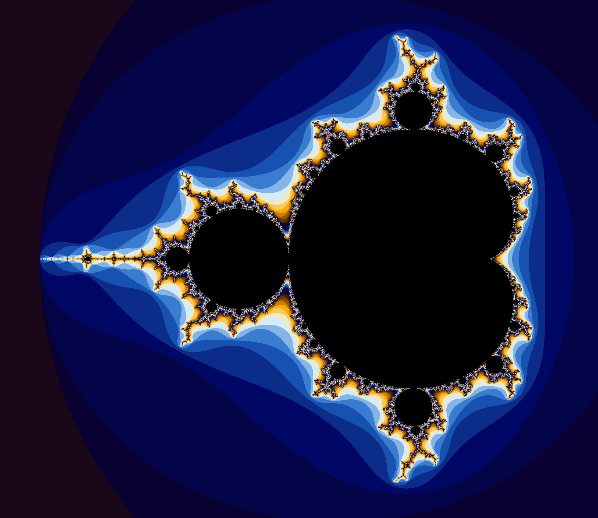

# mandelbrot
 A console app that generates an image of the Mandelbrot set. The Mandelbrot set is the set of complex numbers **c** for which the function **f(z) = z^2 + c** does not diverge when iterated from **z = 0**.
 
 
